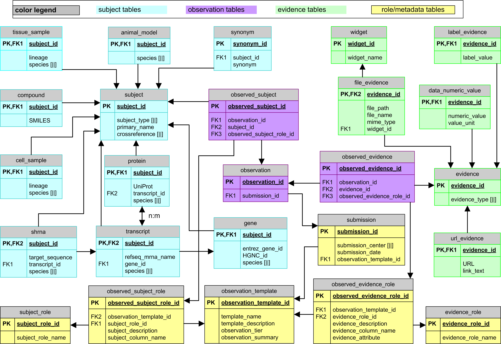
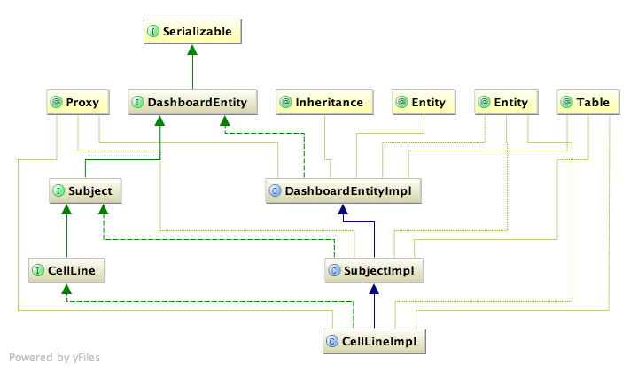
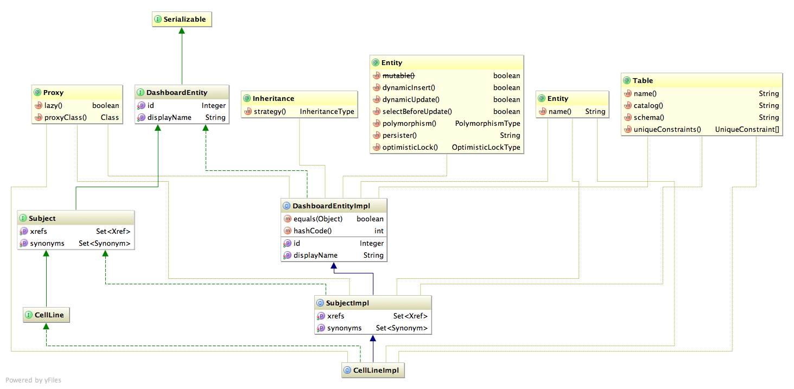

# About
This project starts with rebranding the codebase of CTD^2 Dashboard project. It encapsulates three modules:

* **Core**: contains the main data structures and basic DAO methods.
* **Admin**: contains importers/normalizers/converters for populating the database (depends on _core_)
* **Web**: provides a Web-based API for querying the database; also contains a thin-client (known as _Signature Web UI_) that helps with basic navigation

# Install
The code is structured as a _Maven_ project. 
We suggest you work in an environment with `JDK 1.6.x`, `Tomcat 6.x`, `MySQL 5.0.x` and `Maven 3.x.x` properly installed.
You will need two databases: one for the production, by default **hipc_signature**, and one for the testing, again by default **hipc_test**.

Before running any _mvn_ jobs, make sure you do the basic configuration.
Example configuration files are provided within the distribution.
The easiest way to do the configuration is as follows:

	# this is for Log4j properties, no need to edit unless you want your logs to be saved
	cp -f core/src/main/resources/log4j.properties.example core/src/main/resources/log4j.properties
	# the following contains main properties (including database user/password)
	# please make sure you edit minimally the USER/PASSWORD pair and the TEST/MAIN database URLs.
	cp -f core/src/main/resources/META-INF/spring/signature.properties.example core/src/main/resources/META-INF/spring/signature.properties

After you are done with the configuration, you will be good to go ahead for a basic _install_:

	mvn clean install

The command above will compile the project, run the tests and create the necessary jar/war files for you.
Make sure the tests are sucessfully completed.
From here on you can follow the module-specific notes below.
  
# Notes about modules
## Core: Data structures and DAO methods
This module tries to capture the main database schema outlined below:

We are taking advantage of _factory pattern_ and also separating class definitions (interfaces) and their actual implementations (`*Impl`s) for convenience.
We basically try to convey the following basic ideas in our implementation:

1. Every item that is going to be persisted in the database is of type `DashboardEntity`.
2. Every `DashboardEntity` has a unique id, which is autogenerated by the database (_i.e._ when persisted in the database); therefore id spaces do not clash.
3. All new instances of the classes should be created via `DashboardFactory` -- this is for better handling of the semantics.

So let's take `Compound` as an example.
The class `Compound` is actually an interface that extends the `Subject` interface which, in turn, extends the `DashboardEntity` interface.
The interface determines which methods a class should provide.
The actual implementation of the methods goes into the class `CompoundImpl` which, programmatically speaking, implements `Compound`.
This is better explained with the following simple UML diagram:

The following UML diagram also shows properties and methods in a detailed manner:

Because of these implementation choices, the good practice for creating a new instance of a specific object is as follows:

	// Demonstration of how a new instance of an object should be created

	// Create a factory
	DashboardFactory dashboardFactory = new DashboardFactory();

	// Factory grabs the actual implementation and binds it to the object
	Compound compound = dashboardFactory.create(Compound.class);
	// Developer modifies the object through the methods defined in the interface
	String pyrethrinII = "COC(=O)C(\\C)=C\\C1C(C)(C)[C@H]1C(=O)O[C@@H]2C(C)=C(C(=O)C2)CC=CC=C";
	compound.setSmilesNotation(pyrethrinII);
	compound.setDisplayName("Pyrethrin II");

Furthermore, the interfaces do not know about the persistence details -- that is, column/table names and _etc_.
We do not empose a pre-set SQL schema onto the persistence layer, but instead let `Hibernate` deal with the details -- *i.e.* creating the schema.
So all `Hibernate` and `Persistence` annotations go into the _*Impl*_ classes which use the actual interfaces as *Proxy* (see the UML diagram above). 
The specific details -- database dialect, usernames, passwords, database names -- are all defined in the `signature.properties` file mentioned above.

Basic querying methods are implemented as part of the `DashboardDao`.
Developers do not have to deal with the configuration and/or initialization of the _Dao_ class, 
but rather they can get it through _Spring_ facilities, _e.g._:

	ApplicationContext appContext = new ClassPathXmlApplicationContext("classpath*:META-INF/spring/applicationContext.xml");
	DashboardDao dashboardDao = (DashboardDao) appContext.getBean("dashboardDao");

`DashboardDao` can be used to persist objects:

	Synonym synonym = dashboardFactory.create(Synonym.class);
	synonym.setDisplayName("Synonym 1");
	dashboardDao.save(synonym);

Normally, you don't have to worry about the `id` field.
When an object is created via `DashboardFactory`, it has an id of `null`.
When it gets persisted, the `id` field is updated with the automatically-generated value:

	Synonym synonym = dashboardFactory.create(Synonym.class);
	assert synonym.getId() == null;
	dashboardDao.save(synonym);
	assert synonym.getId() != null;

`DashboardDao` can also be used to acquire objects that are already in the database:

	// Grabs all compounds in the database
	List<Compound> allCompounds = dashboardDao.findEntities(Compound.class);

	// or more generic entities, for example all Subjects
	List<Subject> allSubjects = dashboardDao.findEntities(Subject.class);

or to conduct a find operation:

	List<Compound> compoundsBySmiles = dashboardDao.findCompoundsBySmilesNotation(pyrethrinII);

## Admin: Importers/Converters and major database operations 
This module provides a command-line interface (CLI) for users to populate the database via utilization of data importers.
When `mvn install` is called either on this module or on the parent module, 
a JAR file with all its dependencies included is generated under the default `target/` directory.
This JAR file can be run via the following command:

	java -jar admin/target/dashboard-admin.jar

For example:

	java -jar admin/target/dashboard-admin.jar -h

will list all available options to you.  For more information about running the admin tool, please visit the [Signatures Admin Tool](https://github.com/geworkbench-group/hipc-signature/blob/master/admin_tool.md) page.

## Web: HIPC Signature UI/Web API
### Deploy
This module will create a single _war_ file for the Web API/UI.
You can simply deploy this application, with the following generic command:

	cp -f web/target/web.war $TOMCAT_HOME/webapps/hipc-signature.war

or better, especially if you do not want to deal with a new Tomcat installation, you can take advantage of the _mvn tomcat_ plugin:

	cd web/
	mvn tomcat:run-war

and point your browser to [http://localhost:8080/hipc-signature/#](http://localhost:8080/hipc-signature).

### Notes about design
Here are a few quick comments from Arman about this prototype:

 * This is just the first iteration, so please feel free to comment and hopefully the design will converge accordingly
 * I decided to color code main categories (blue/red/orange/green) and I think it turns out quite well since it will allow any cross-link (e.g. from drug-view to target-view) to pop-up to the eye
 * I have not optimized things on the mobile side, so although I believe it will work fine on an iPad; it might lack some of the eye-candies on a mobile phone due to size limitations.
 * I have altered the main "tiles-design" pattern a little bit in order to be able to put an emphasis on "Stories" -- so this is why it is being shown by default. This is something between what Chris initially suggested and what Daniela wanted to see.
